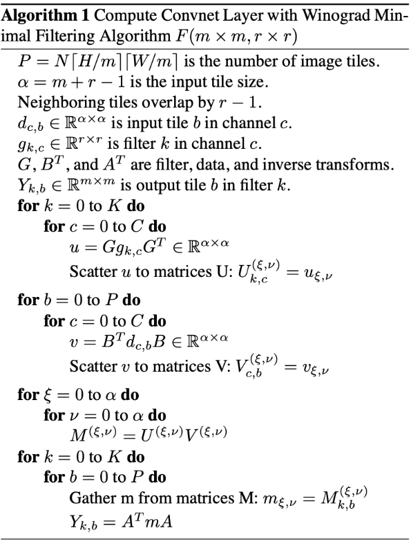
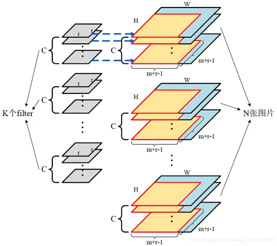

# 七边形 2025 年春季招新题目！

嗨，欢迎来做七边形的招新题！

招新题是一个 C/C++ 小项目，使用 Make 构建。你需要对这个项目做你能想到的性能优化，使其在保持正确性的前提下，跑得尽可能快。

* 我们将会提供七边形的机器供大家在上面编程和调试（具体细节会在笔试 QQ 群中公布）。最终加速比（也就是性能表现）将会以在七边形机器上测试的结果为准。
* 集群使用 [spack](https://spack.readthedocs.io/en/latest/) 进行包管理，你可以通过spack找到一些你想要的包。
* 默认的机器（即登录节点）仅有一台，开启了超线程且没有 GPU。但队内集群中数个计算节点包含GPU。集群通过 [slurm](https://slurm.schedmd.com/documentation.html) 进行管理，如果你编写了很酷的 GPU 加速代码，请使用 slurm 运行你的应用程序。 
* 我们强烈建议使用slurm在计算节点上运行任务，在登录节点上长时间运行重负载的任务是**不允许**的，并且测出来的性能数据也**不准确**。
* 如果遇到无法解决的问题，可以在联系笔试QQ群管理员获取相关支持。

请仔细阅读下面的规则、题目详情和提交方式。

截止时间为 **2025年4月4日23:59**。你需要要那之前**完成并提交**所有工作。


## 题目背景介绍

2012年至2018年是卷积神经网络快速发展时期，AlexNet、VGG、ResNet等经典网络通过堆叠卷积层实现图像识别突破。这些模型的核心是conv2d运算——它用滑动窗口扫描输入数据，通过局部加权求和提取特征。其中3x3大小、步长为1的卷积核最为常用：既能通过多层叠加扩大感知范围，又保持较小的参数量，同时适配硬件并行计算。这一基础算子至今仍是计算机视觉的基础组件。一个用OpenMP并行的conv2d算法（滑动窗口法，步长为1，边缘填充为0）的伪代码如下：

```c++
void naive_conv(float *image,
                float *filter,
                float *out,
                const int batch_size,
                const int input_channel,
                const int height,
                const int width,
                const int output_channel) {
  typedef float(*image_tensor_t)[input_channel][height][width];
  typedef float(*filter_tensor_t)[input_channel][FLT_H][FLT_W];
  typedef float(*out_tensor_t)[output_channel][height - 2][width - 2];
  image_tensor_t image_tensor = (image_tensor_t)image;
  filter_tensor_t filter_tensor = (filter_tensor_t)filter;
  out_tensor_t out_tensor = (out_tensor_t)out;
#pragma omp parallel for collapse(4)
  for (int64_t batch = 0; batch < batch_size; ++batch) {
    for (int64_t oc = 0; oc < output_channel; ++oc) {
      for (int64_t oh = 0; oh < height - 2; ++oh) {
        for (int64_t ow = 0; ow < width - 2; ++ow) {
          out_tensor[batch][oc][oh][ow] = 0;
          for (int64_t ic = 0; ic < input_channel; ++ic) {
            for (int64_t kh = 0; kh < 3; ++kh) {
              for (int64_t kw = 0; kw < 3; ++kw) {
                out_tensor[batch][oc][oh][ow] += image_tensor[batch][ic][oh + kh][ow + kw] *
                                                 filter_tensor[oc][ic][kh][kw];
              }
            }
          }
        }
      }
    }
  }
}
```


**winograd算法** 是一种快速的卷积算法。是1980年 Shmuel Winograd 提出用来减少FIR滤波器计算量的一个算法。该算法通过增加加法操作来降低卷积算法中的较慢的乘法操作；若是采用直接按滑动窗口方式计算 $r \times s$ 的卷积核在 $m \times n$ 大小的图片上的卷积（步长为1，边缘填充为1），需要 $m \times n \times r \times s$ 次乘法；而采用 winograd 算法：其乘法数量减少到 $(m+r−1)(n+s−1)$ ，从而提高性能。该算法自提出后，于2016年在深度学习领域被重新发现并应用。基础算法如下图所示（摘自 https://arxiv.org/abs/1509.09308 ）。




本次招新的笔试任务是对**winograd算法**进行优化。该算法实现了 $F(4 \times 4, 3 \times 3)$ 的 winograd 算法，即将输出图像按 $4 \times 4$ 做分片（tiling），卷积核的大小是 $3 \times 3$ 。该算法实现了**批量卷积**的计算，即输入数据的图片是 $(Batch，IC, H, W)$ 形状的张量（多维数组），其中 $Batch$ （有些论文也用 $N$ 作为记号）是批次大小， $IC$ （有些论文也用 $C$ 作为记号）是输入通道数， $H$ 是图片高度， $W$ 是图片宽度。卷积核的是 $(OC, IC, R, S)$ 形状的张量，其中 $OC$ （有些论文也用 $K$ 作为记号）是输出通道数， $IC$ 是输入通道数， $R = S$ 是卷积核的大小。计算过程中，输入图片没有填充（padding），卷积核的步长是 $1$ 。输入通道 $IC$ 会被规约（Reduce），因此输出的图片是 $(Batch, OC, H-R+1, W-S+1)$ 形状的张量。批量卷积的计算示意图如下图所示（摘自 https://arxiv.org/abs/1509.09308 ）。




**Winograd算法** 的一个关键技巧是分片（tiling），即将输出图片分片，分片后的每个tile在输入图片上也会有一个对应的tile，并且输入图片上的tile像瓦片那样边缘互相重叠。本次实验的代码已经实现了分片（见`get_tile_index`和`get_tiling_info`这两个函数）。为了使大家更容易理解和上手，我们还实现了张量排布的转换来提升访存的空间局部性（见`image_packing`、`filter_packing`和`output_unpacking_store`这三个函数）。

## 项目结构

项目目录如下，其中标记`*`号的文件是**不允许修改或删除的**，其他文件则是可以修改的。

```
.
├── .clang-format
├── .gitignore
├── conf
│   ├── small.conf
│   └── vgg16.conf
├── driver.cc *
├── Makefile
├── README.md
├── run.sh
├── utils.h
├── winograd.cc
└── winograd.h *

```
* `.clang-format` 用于规范代码风格。
* `.gitignore` 用于告诉git忽略一些文件。
* `conf/`目录存放了计算所需的输入数据。我们目前提供了2个规模的算例。
* `driver.cc`是主程序入口，负责读取输入数据，调用 `winograd.cc` 中的函数进行计算，并输出结果。
* `Makefile` 是构建文件，用于编译整个项目。
* `README.md` 是本文件，负责说明整个项目。
* `run.sh` 是用于提交 slurm 任务的脚本。
* `utils.h` 是一些辅助函数的声明。
* `winograd.cc` 是你需要优化的文件，其中包含了 winograd 算法的实现。
* `winograd.h` 是 `winograd.cc` 的头文件。

## 编译、运行和测试

通过以下命令行命令构建项目。

```bash
make
```

通过以下命令直接在命令行执行性能测试（Benchmark Mode），

```
./winograd conf/small.conf
```

通过以下命令将任务提交给slurm系统上的计算节点执行（我们已经写好了作业脚本run.sh，如果想要测试不同的case或者执行正确性验证， 你需要修改作业脚本run.sh）。

```
sbatch run.sh
```

你会看见如下输出（也是small.conf的baseline）。

```bash
Layer 0 :  Elapse time 0.013987 ms. (    0.99 GFlops) 
Layer 1 :  Elapse time 0.039339 ms. (    1.76 GFlops) 
Layer 2 :  Elapse time 1.464367 ms. (    1.70 GFlops) 
Layer 3 :  Elapse time 25.849660 ms. (    6.57 GFlops) 
Layer 4 :  Elapse time 826.042652 ms. (    6.58 GFlops) 
Total elapse time: 0.853410. (    6.57 GFlops) 
```

而vgg16.conf的baseline如下（该测试相当耗时）：

```bash
Layer 0 :  Elapse time 8186.878602 ms. (    1.33 GFlops) 
Layer 1 :  Elapse time 40464.980682 ms. (    5.75 GFlops) 
Layer 2 :  Elapse time 18053.032001 ms. (    6.33 GFlops) 
Layer 3 :  Elapse time 35898.586353 ms. (    6.36 GFlops) 
Layer 4 :  Elapse time 16899.485032 ms. (    6.51 GFlops) 
Layer 5 :  Elapse time 41035.766999 ms. (    5.36 GFlops) 
Layer 6 :  Elapse time 41052.740335 ms. (    5.36 GFlops) 
Layer 7 :  Elapse time 40832.878272 ms. (    5.39 GFlops) 
Layer 8 :  Elapse time 20145.650625 ms. (    5.07 GFlops) 
Layer 9 :  Elapse time 43018.066645 ms. (    4.75 GFlops) 
Layer 10:  Elapse time 42978.799979 ms. (    4.75 GFlops) 
Layer 11:  Elapse time 43129.189968 ms. (    4.73 GFlops) 
Layer 12:  Elapse time 8022.422632 ms. (    5.42 GFlops) 
Layer 13:  Elapse time 7970.119715 ms. (    5.46 GFlops) 
Layer 14:  Elapse time 7960.529010 ms. (    5.46 GFlops) 
Layer 15:  Elapse time 7955.145677 ms. (    5.47 GFlops) 
Total elapse time: 423.604273. (    5.30 GFlops) 
```


通过以下命令执行正确性验证（Validation Mode，注意应当提交到计算节点）。

```
./winograd conf/small.conf 1
```

你会看见如下输出，如果输出 `Validation Passed!` 即通过正确性验证。

```bash
Layer 0 : (Channel Height Weight Filter Batch) = (3   10  10  2   2  ) : Validation Passed !
Layer 1 : (Channel Height Weight Filter Batch) = (3   10  10  10  2  ) : Validation Passed !
Layer 2 : (Channel Height Weight Filter Batch) = (3   50  50  10  2  ) : Validation Passed !
Layer 3 : (Channel Height Weight Filter Batch) = (32  50  50  64  2  ) : Validation Passed !
Layer 4 : (Channel Height Weight Filter Batch) = (32  50  50  64  64 ) : Validation Passed !
```

通过以下命令清理构建产物。

```bash
make clean
```


## 技术要求
* 在**不更改计算逻辑**（即必须使用 winograd 算法计算卷积）且 **结果正确** 的情况下，可以任意修改项目源文件及构建文件（除了标记*号的文件以外）。
* 使用CPU的核心数和内存大小没有限制。
* 如果不清楚一种优化手段是否符合要求，可以在QQ群中询问。

### 明确允许的优化手段
* 允许更换编译器（你可以在 spack 中寻找编译器），允许修改编译选项（包括优化等级）。
* 允许一般的并行手段如OpenMP、SIMD等。
* 鼓励选手使用OpenACC、CUDA/HIP、SYCL等技术进行GPU加速。
* 在通过正确性验证（相对误差小于1%）的前提下，允许使用不低于 16bit 的浮点数进行量化。
* 线性代数库的使用。允许且只允许使用cuBLAS库进行加速，其他线性代数库（OpenBLAS、MKL）不允许使用。我们鼓励大家自己手写GEMM等算子。
* 允许更改分片（tile）的大小，比如实现 $F(6 \times 6, 3 \times 3)$ 的 winograd 算法。
### 明确禁止的优化手段
* 本题目主要考察对该算法的优化，故**禁止**调用任何已经实现卷积算法的库。
* **禁止**根据输入数据的某些特征对程序进行优化，例如打表等。


## 最终评测

* 最终评测时，我们会通过`make`构建你的程序。然后通过`sbatch run.sh`将你的任务提交给slurm执行。因此，确认你的`Makefile`和`run.sh`是正确的。
* 测评时可能会增加新的算例。
* 测评时采用Benchmark Mode下输出的GFLOPS作为性能的标准；其中浮点操作次数是按滑动窗口法计算的。
* 精度要求：和单精度滑动窗口法卷积相比，相对误差小于1%。

## 提交要求

### 代码
* 笔试开始时，你需要 clone 题目仓库，并创建一个自己的 GitHub 私有仓库，开发过程中使用git进行版本控制。
* **在代码提交截止时间前**，你应该将自己的 GitHub 仓库链接以 issue 的方式发表在本仓库下，注明姓名等个人信息。
* 你的GitHub仓库应该包含优化实现的代码，并且在提交时设置为公开。性能最优的代码应该在main分支上。
* 你的GitHub仓库的main分支应该包含一个名为performance.txt或performance.md的文件，内容是你在vgg16.conf算例上所取得的性能最优结果（在计算节点上，以Benchmark Mode运行的输出）。
* 确认你的`Makefile`和`run.sh`是正确的，请确保你的代码可以在我们提供的机器上编译和运行；请确保代码的正确性和健壮性，我们会用不同的输入数据对代码进行测试。
* 确保代码符合上一节所述**技术要求**；请确保代码的可读性，包括但不限于代码风格、注释等（建议使用VSCode的Clang-Format插件）。
* 如你觉得有必要，你可以在 README.md 中补充一节文字简要说明你的代码的依赖（如果使用了spack中的软件）、构建方式和运行方式。你可以用一个`env.sh`文件来定义依赖，比如使用了nvcc编译器，你可以编写如下`env.sh`文件，我们就可以通过`source env.sh`来加载spack依赖。

```bash
#!/bin/bash

eval `spack load --sh cuda` 
```
   
### 技术答辩PPT

**在代码提交截止时间，你需要制作并提交一份 ppt**，内容如下：

* 每一步优化的思路、过程和效果（举例：使用了 xxx 优化，相对于原代码，速度提升了 114.514 倍）；
* 用perf、vtune等工具对程序进行性能剖析（profile），以了解性能瓶颈；
* 你在解题过程中所参考的资料（如有使用人工智能工具，请注明并附上包含prompt的对话截图）；
* 在解题过程中，遇到的有意思的事情，或者是让你印象深刻的 bug（可选）；

代码审查会用到这份 ppt，我们会**通过飞书问卷收集**； 另外，在笔试结束后（具体时间另外通知）你需要准备一次展示（也会用到这份 ppt），向我们介绍你的优化成果。

如果对题目本身或者提交方式有任何问题，请积极在QQ群里讨论。

## 提示

### 工具链相关

* Slurm 怎么用喵？ <http://scc.ustc.edu.cn/zlsc/user_doc/html/slurm/index.html>
* 良好的版本控制习惯可以有效避免 “改了一下午代码后它跑不起来了，但是我又改不回去了” 之类的极端情况。推荐使用 [Git](https://git-scm.com/) 记录自己的开发过程；如果你尝试了多种优化路线，可以通过git分支来管理。
* 使用 htop/glances/nvtop 或者资源管理器查看 CPU/GPU 负载是验证自己程序正在并行工作的好方法之一
* 火焰图可以直观地展示程序的性能热点：<https://www.brendangregg.com/flamegraphs.html>
* Vtune 是 Intel 提供的强大的性能分析工具：<https://software.intel.com/content/www/us/en/develop/tools/oneapi/components/vtune-profiler.html>。你可以在集群上通过`eval $(spack load --sh vtune)`来加载vtune，在vtune记录数据结束后使用`vtune-backend --data-directory <path/to/parent/directory/of/vtune_result>`打开一个**登录节点**上的端口，你会看见输出形如 `VTune Profiler GUI is accessible via https://127.0.0.1:38909/`。如果你使用VSCode，VSCode会自动帮你完成端口转发；你也可以尝试手动端口转发。
* Perf 是 Linux 下一个简单易用的的性能分析工具：<https://www.brendangregg.com/perf.html>
* OpenMP 是常用的并行计算框架：<https://bisqwit.iki.fi/story/howto/openmp/>，通过OpenMP官方代码示例学习OpenMP：<https://www.openmp.org/wp-content/uploads/openmp-examples-5.0.0.pdf>
* 通过OpenACC+NVHPC套件可以在CPU或者GPU上进行并行计算：<https://openacc-best-practices-guide.readthedocs.io/en/latest/> <https://docs.nvidia.com/hpc-sdk/archive/24.3/index.html>
* SIMD 是提升程序单核性能的有效手段：<https://zhuanlan.zhihu.com/p/583326378> <https://www.intel.com/content/www/us/en/docs/intrinsics-guide/index.html#>
* 适量的 Cache 知识不仅对单核优化有用，也能避免一些多线程场景下的诡异问题：<https://zhuanlan.zhihu.com/p/136300660>
* 更加系统性的高性能计算知识，请参考七边形的 HPC 学习路线：<https://heptagonhust.github.io/HPC-roadmap/>

### 题目相关
* Winograd 的一篇中文综述：<https://dds.sciengine.com/cfs/files/pdfs/view/1673-9418/A1CA8B3CEE27446E9DBF39B960E58D4F.pdf>
* Winograd 介绍可以在这篇论文中找到 <https://arxiv.org/abs/1509.09308>
* Winograd 在CPU上的优化: <https://arxiv.org/abs/2411.16152>
* Winograd 在GPU上的优化: <https://dl.acm.org/doi/10.1145/3332466.3374520>
* Winograd 在GPU上的优化: <https://dl.acm.org/doi/10.1145/3472456.3472473>
* 你可以在google scholar或arxiv上搜索更多关于winograd算法实现和优化的论文，或者在Github上搜索更多关于winograd算法实现和优化的代码。
* How to optimize gemm: <https://github.com/flame/how-to-optimize-gemm/wiki>
* cuBLAS: <https://docs.nvidia.com/cuda/cublas/>
* Batched matrix multiply: <https://developer.nvidia.com/blog/cublas-strided-batched-matrix-multiply/>
* winograd 系数计算器：<https://github.com/andravin/wincnn>
* ppl: <https://github.com/OpenPPL/ppl.kernel.cpu>

### 以及一些技术无关的提示

* 如果遇到问题，请积极在 QQ 群内提问
* 部分优化可能相当难做/难调。所以即使没有写出程序/调试成功，也欢迎把自己的天才优化想法写进提交的文档里，通过文字来展示自己对高性能计算的理解和认知。